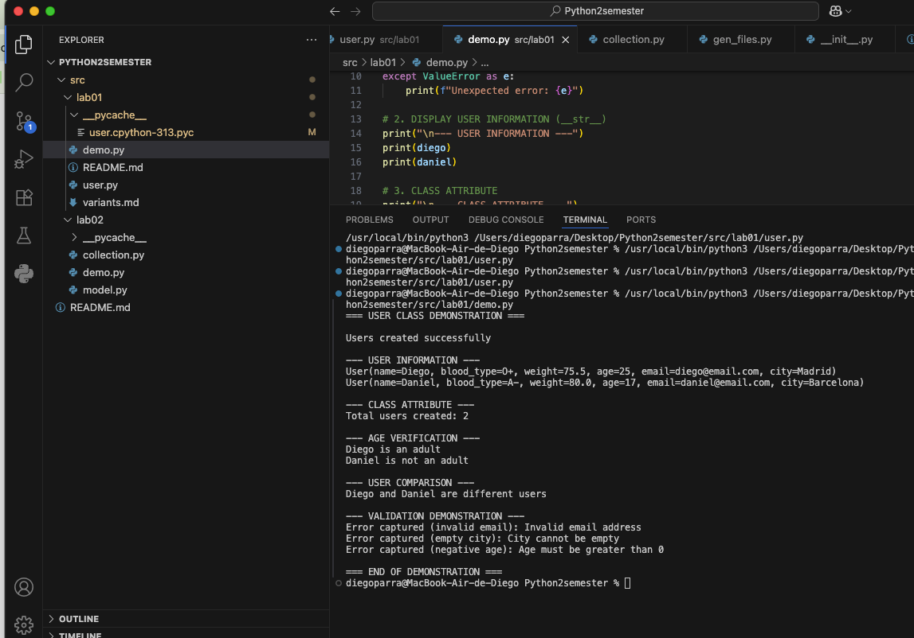
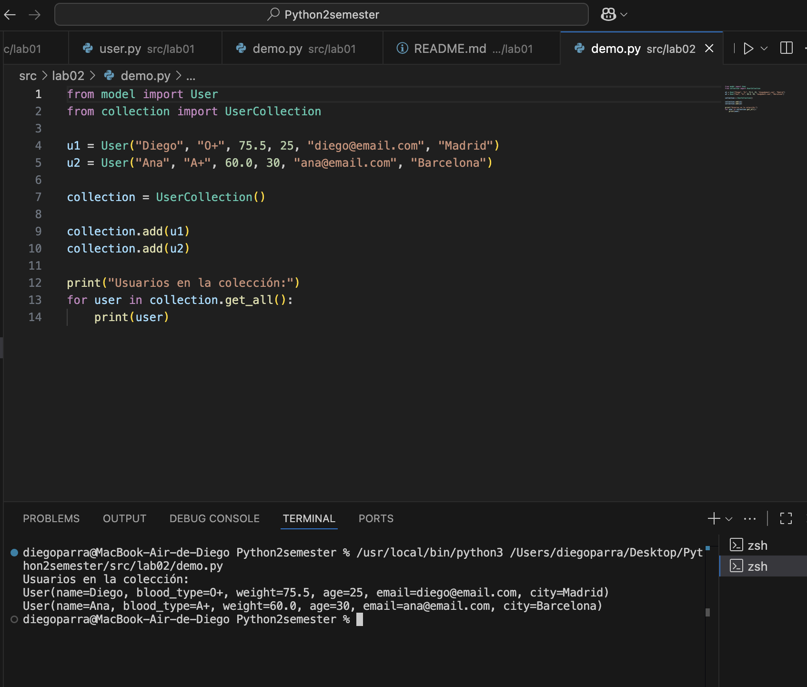

# python_oop
OOP second Semester
# ЛР-1 — Класс и инкапсуляция (Python 3.x)

## Цель работы

* Освоить объявление пользовательских классов.
* Разобраться с инкапсуляцией (атрибуты экземпляра, закрытые поля).
* Реализовать свойства (`@property`).
* Переопределить магические методы (`__str__`, `__repr__`, `__eq__`).
* Осознать разницу между атрибутами класса и экземпляра.

---

# Результат лабораторной

## Демонстрация

### Код программы (demo.py)

```python
from user import User

print("=== USER CLASS DEMONSTRATION ===\n")

# 1. CREATING VALID OBJECTS
try:
    diego = User("Diego", "O+", 75.5, 25, "diego@email.com", "Madrid")
    daniel = User("Daniel", "A-", 80.0, 17, "daniel@email.com", "Barcelona")
    print("Users created successfully")
except ValueError as e:
    print(f"Unexpected error: {e}")

# 2. DISPLAY USER INFORMATION (__str__)
print("\n--- USER INFORMATION ---")
print(diego)
print(daniel)

# 3. CLASS ATTRIBUTE
print("\n--- CLASS ATTRIBUTE ---")
print(f"Total users created: {User.total_users}")

# 4. BUSINESS METHOD (is_adult)
print("\n--- AGE VERIFICATION ---")
if diego.is_adult():
    print(f"{diego._name} is an adult")
else:
    print(f"{diego._name} is not an adult")

if daniel.is_adult():
    print(f"{daniel._name} is an adult")
else:
    print(f"{daniel._name} is not an adult")

# 5. COMPARISON (__eq__)
print("\n--- USER COMPARISON ---")
if diego == daniel:
    print("Diego and Daniel are the same user (same email)")
else:
    print("Diego and Daniel are different users")

# 6. VALIDATION DEMONSTRATION (with try/except)
print("\n--- VALIDATION DEMONSTRATION ---")

try:
    invalid_user = User("Error", "O+", 70, 30, "invalid-email", "Seville")
except ValueError as e:
    print(f"Error captured (invalid email): {e}")

try:
    invalid_user = User("Error", "O+", 70, 30, "test@email.com", "")
except ValueError as e:
    print(f"Error captured (empty city): {e}")

try:
    invalid_user = User("Error", "O+", 70, -5, "test@email.com", "Valencia")
except ValueError as e:
    print(f"Error captured (negative age): {e}")

print("\n=== END OF DEMONSTRATION ===")
---
```
## Демонстрация

Результат выполнения программы:



---

# ЛР-2 — Коллекция объектов (Python 3.x)

## Цель работы

* Научиться работать с коллекциями объектов.
* Понять разницу между моделью сущности и контейнером объектов.
* Реализовать собственный контейнерный класс.
* Освоить итерацию по объектам.
* Реализовать базовые операции управления коллекцией.

---

## Результат лабораторной

В данной лабораторной работе реализован контейнерный класс `UserCollection`, который управляет объектами класса `User`.

Коллекция позволяет:

* добавлять и удалять пользователей  
* искать пользователей  
* итерироваться по коллекции  
* получать длину (`len`)  
* работать с индексами  
* сортировать данные  
* фильтровать пользователей  

---

## Демонстрация

### Код программы (demo.py)

```python
# from model import User
from collection import UserCollection

print("=== LAB02 DEMO ===\n")

u1 = User("Diego", "O+", 75.5, 25, "diego@email.com", "Madrid")
u2 = User("Ana", "A+", 60.0, 30, "ana@email.com", "Barcelona")
u3 = User("Luis", "B+", 80.0, 17, "luis@email.com", "Paris")

collection = UserCollection()

# agregar
collection.add(u1)
collection.add(u2)
collection.add(u3)

print("Usuarios en la colección:")
for user in collection.get_all():
    print(user)

# len()
print("\nTotal de usuarios:", len(collection))

# búsqueda (si tienes método, si no, lo dejas)
try:
    print("\nBuscar Diego:")
    print(collection.find_by_name("Diego"))
except:
    print("Método find_by_name no implementado")

# eliminar
collection.remove(u3)

print("\nDespués de eliminar a Luis:")
for user in collection.get_all():
    print(user)
```


